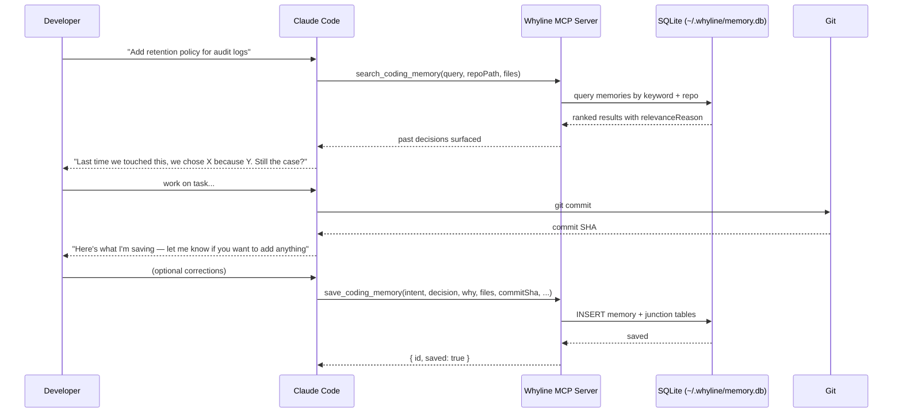
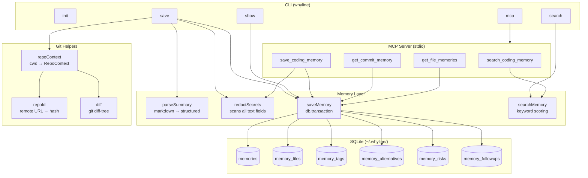
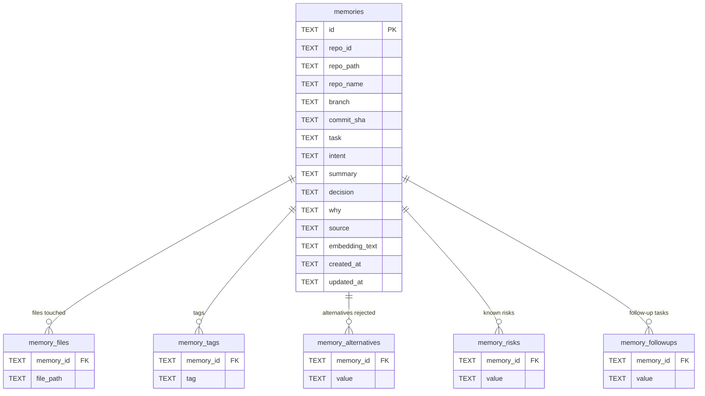
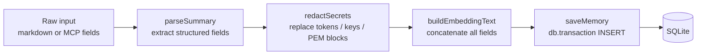
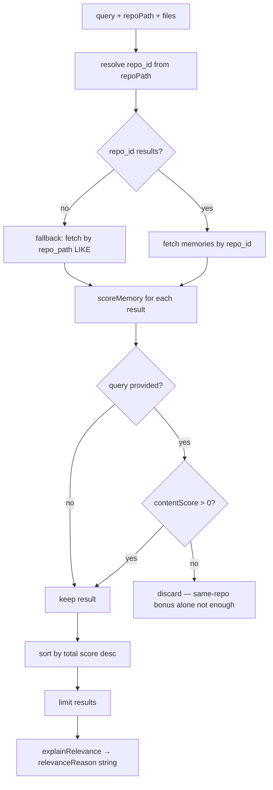
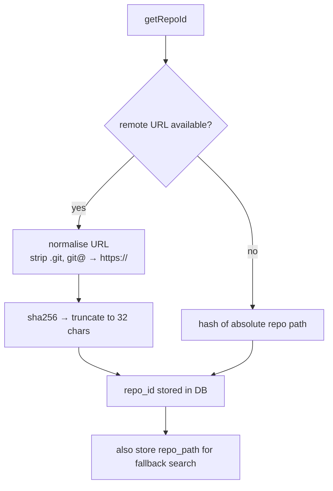
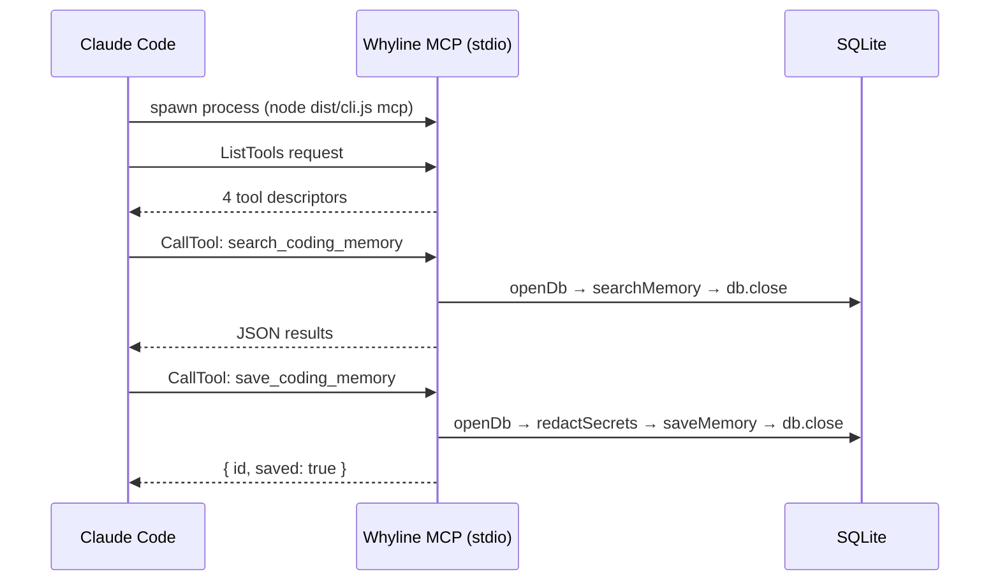

# Whyline — Architecture

## What it does

Whyline captures the reasoning behind code changes and makes it available to future AI coding sessions.

Git stores diffs. Whyline stores the *why* — the intent, the decision, the alternatives that were rejected, the risks that were acknowledged. It does this by sitting at two points in the development loop:

- **Session start** — searches past memories and surfaces relevant context to Claude before any code is touched
- **After commit** — synthesizes the conversation into a structured record and saves it to a local SQLite database

No cloud. No background daemon. No extra UI. Just a CLI and an MCP server.

---

## The development loop



---

## System components



---

## Data model

A single **memory** record captures one coding session. All list fields are stored in separate junction tables and joined at read time.



---

## Save pipeline

When a memory is saved (via CLI or MCP), every text field passes through the same pipeline before touching the database.



**Secret patterns redacted:**
- GitHub tokens (`ghp_`, `gho_`, `ghs_`)
- npm tokens (`npm_`)
- AWS access keys (`AKIA...`)
- Bearer tokens
- `.env`-style assignments (`API_KEY=value`)
- PEM private key blocks

---

## Search pipeline

Search is deterministic keyword scoring — no embeddings, no external service.



**Score weights:**

| Component | Points |
|-----------|--------|
| Same repo | +10 |
| File overlap | +8 |
| Tag match | +5 |
| Decision match | +4 |
| Why match | +3 |
| Summary match | +2 |
| File path match | +2 |
| Recency (≤30 days) | +1 |

The `relevanceReason` field in search results describes which components fired, e.g. `"Matched: same repo (+10), tag match (+5), decision match (+4)"`.

---

## Repo identity

Whyline needs a stable identifier for each repo so memories can be scoped and searched correctly even if the repo is cloned to a different local path.



This means memories survive repo renames and remain queryable by path if the remote changes.

---

## MCP integration

The MCP server runs as a stdio process, launched by Claude Code when a session starts in a repo that has `.mcp.json`.



The DB connection is opened and closed per request — no persistent connection. All stdout is reserved for JSON-RPC; logs go to stderr only.

---

## Directory structure

```
src/
  cli.ts                  entry point, commander, shebang
  config.ts               DATA_DIR, DB_PATH, resolveConfig(), isInitialized()
  commands/
    init.ts               create ~/.whyline/, run migrations
    save.ts               parse markdown → redact → save
    search.ts             resolve repo, score, print results
    show.ts               fetch by id or commit SHA
    mcp.ts                start MCP stdio server
  db/
    connection.ts         openDb() — WAL + foreign_keys
    schema.ts             MIGRATIONS[] — versioned SQL
    migrations.ts         runMigrations() — idempotent
  git/
    git.ts                getRepoRoot, getCurrentBranch, resolveCommit
    repoId.ts             getRepoId(), getRepoName(), normalizeRemoteUrl()
    diff.ts               getChangedFilesForCommit()
    repoContext.ts        getRepoContext() → RepoContext
  memory/
    types.ts              CodingMemory, ScoreBreakdown, SearchResult, RepoContext
    parseSummary.ts       markdown → structured fields
    redactSecrets.ts      SECRET_PATTERNS[], redactSecrets()
    saveMemory.ts         saveMemory(), getMemoryById(), searchMemory helpers
    searchMemory.ts       scoreMemory(), explainRelevance(), searchMemory()
    repoContext.ts        assembles RepoContext from cwd + ref
  mcp/
    server.ts             createMcpServer() — 4 tools, stdio transport
    tools.ts              Zod schemas for all tool inputs
  output/
    format.ts             formatMemory(), formatSearchResult()
  skill/
    SKILL.md              Claude Code skill instructions
  hooks/
    post-commit.sample.sh reminder hook template
```
